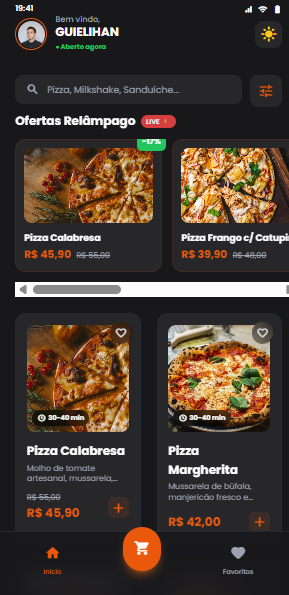
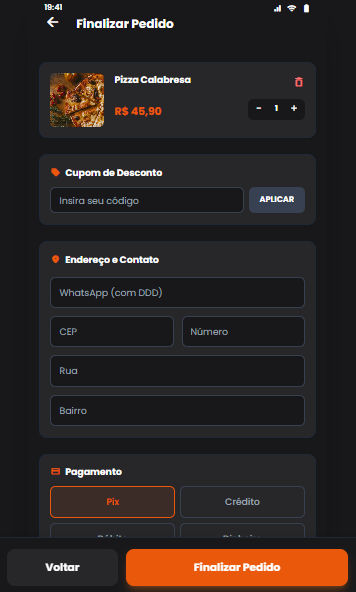
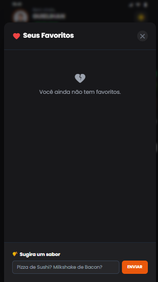

# 🍕 Cardápio Digital Interativo

## 👨‍💻 Desenvolvedor

**Guilherme Queiroz (Guielihan)**

- 📧 Email: [guielihan@outlook.com](mailto:guielihan@outlook.com)
- 💬 Discord: guielihan
- 🎓 Curso: MVP Flow - GoDevs
- 👨‍🏫 Professor: Luan

<div align="center">
  
  
  
  
  

  **Atividade do Curso MVP Flow - GoDevs**  
  **Professor: Luan**

</div>

---

## 📸 Demonstração Visual

<div align="center">

### 🎨 Interface Principal - Modo Claro


### 🌙 Interface Principal - Modo Escuro


### 🛒 Carrinho de Compras


### ⭐ Produtos Favoritos


</div>

---

## 📋 Sobre o Projeto

Cardápio digital moderno e interativo desenvolvido como atividade prática do **Curso MVP Flow**, ministrado pelo **Professor Luan** da equipe **GoDevs**. 

Sistema completo de pedidos online com carrinho de compras, favoritos, modo escuro/claro e interface responsiva, construído com React, TypeScript e Vite.

### ✨ Funcionalidades

- 🛒 **Carrinho de Compras** - Adicione, remova e gerencie pedidos
- ⭐ **Sistema de Favoritos** - Salve seus pratos preferidos
- 🌓 **Modo Escuro/Claro** - Alternância de tema suave
- 🔍 **Busca e Filtros** - Encontre rapidamente o que procura
- 📱 **Design Responsivo** - Funciona perfeitamente em qualquer dispositivo
- 💳 **Checkout Completo** - Sistema de finalização de pedidos
- 🎨 **Interface Moderna** - Design clean com animações suaves

### 🛠️ Tecnologias Utilizadas

- **React 19.2.0** - Biblioteca JavaScript para construção de interfaces
- **TypeScript 5.8.2** - Superset JavaScript com tipagem estática
- **Vite 6.2.0** - Build tool extremamente rápido
- **Tailwind CSS** - Framework CSS utility-first
- **Lucide React** - Ícones modernos e leves

## 🚀 Como Executar

### Pré-requisitos

- Node.js (versão 16 ou superior) - **Nota:** Node.js é usado apenas para o ambiente de desenvolvimento com Vite. Este projeto não possui backend Node.js.
- npm ou yarn

### Instalação

1. Clone o repositório:
```bash
git clone https://github.com/Guielihan/cardapio-atividade-01.git
cd cardapio-atividade-01
```

2. Instale as dependências:
```bash
npm install
```

3. Execute o projeto:
```bash
npm run dev
```

4. Acesse no navegador:
```
http://localhost:3000
```

## 📦 Scripts Disponíveis

```bash
npm run dev      # Inicia servidor de desenvolvimento
npm run build    # Gera build de produção
npm run preview  # Preview do build de produção
```

## � Deploy

Este projeto está configurado para deploy em múltiplas plataformas:

### Vercel (Recomendado)

O projeto já está configurado com `vercel.json` para deploy na Vercel. Você pode fazer o deploy de duas formas:

#### Opção 1: Via Interface Web (Mais Fácil)

1. Acesse [vercel.com](https://vercel.com) e faça login com sua conta GitHub
2. Clique em "Add New Project"
3. Importe o repositório `cardapio-atividade-01`
4. A Vercel detectará automaticamente as configurações do Vite
5. Clique em "Deploy" e aguarde o processo
6. Após o deploy, copie a URL fornecida e atualize o link na seção "Site em Produção" abaixo

#### Opção 2: Via CLI

1. Instale a Vercel CLI:
```bash
npm i -g vercel
```

2. Faça login e deploy:
```bash
vercel login
vercel
```

3. Siga as instruções no terminal e escolha as opções padrão
4. Após o deploy, copie a URL fornecida e atualize o link na seção "Site em Produção" abaixo

### Netlify

1. Instale a Netlify CLI:
```bash
npm i -g netlify-cli
```

2. Faça login e deploy:
```bash
netlify login
netlify deploy --prod
```

### GitHub Pages

O projeto já está configurado com GitHub Actions. Para ativar:

1. Vá em Settings > Pages no seu repositório
2. Selecione "GitHub Actions" como source
3. Push para a branch `main` irá fazer deploy automaticamente

**URL do Deploy:** https://guielihan.github.io/cardapio-atividade-01

## �🎯 Estrutura do Projeto

```
cardapio-atividade-01/
├── components/          # Componentes reutilizáveis
├── services/           # Serviços e APIs
├── App.tsx            # Componente principal
├── types.ts           # Definições TypeScript
├── index.tsx          # Entry point
├── index.css          # Estilos globais
└── vite.config.ts     # Configuração Vite
```

## 🌐 Site em Produção

O site está configurado para deploy na Vercel:

**🔗 URL do Deploy:** [https://cardapio-atividade-01.vercel.app](https://cardapio-atividade-01.vercel.app)

> **✅ Deploy realizado com sucesso!** O site está disponível 24 horas por dia na Vercel.

### ✨ Recursos do Deploy na Vercel

✅ Disponível 24 horas por dia  
✅ HTTPS automático e gratuito  
✅ Deploy automático a cada push na branch principal  
✅ Preview deployments para cada pull request  
✅ CDN global para carregamento rápido  
✅ Analytics e monitoramento de performance

## 📄 Licença

Este projeto foi desenvolvido como atividade do curso MVP Flow ministrado pelo Professor Luan da equipe GoDevs.

---

<div align="center">
  Feito com ❤️ por Guielihan
</div>
